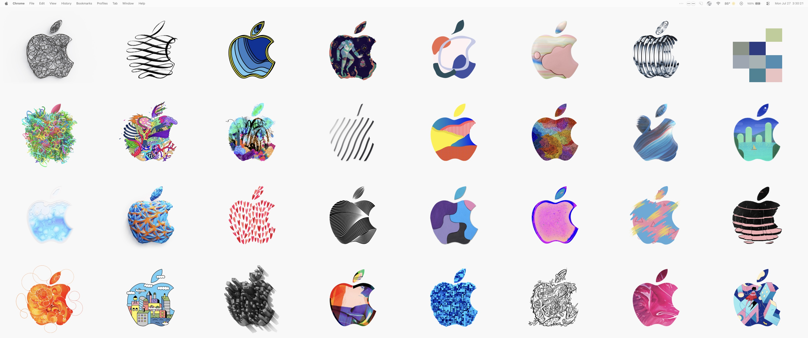

# Apple Logo Wallpaper

A native macOS app animates among the 371 Apple logos created for Apple’s October 30, 2018 special event in Brooklyn continuously changing, multi-monitor wallpaper grid.

[Download the latest](https://github.com/corychainsman/apple-logo-wallpaper/releases/latest/download/Apple-Logo-Wallpaper.dmg)

[](https://ko-fi.com/corychainsman)

[](docs/wallpaper-preview.mp4)

[Watch or download the 1080p preview](docs/wallpaper-preview.mp4). It uses the default 4×8 grid, `angular` transition, 1-second duration, −0.4-second gap, and no randomization.

Learn more about the collection in [MacRumors’ contemporary overview of the event logos](https://www.macrumors.com/2018/10/24/all-the-apple-logos/).

## Highlights

- Independently enable each display and set its row and column counts
- Remember display-specific settings when a monitor is disconnected and reattached
- Shared transition timing and animation settings across displays
- 125 configurable [GL Transitions](https://gl-transitions.com/)
- Sequential or randomized transitions with a per-transition inclusion list
- Negative transition gaps for overlapping animations
- Automatic menu-bar-safe layout on the display that currently shows the menu bar
- Live updates as settings change
- Optional animated Dock and App Switcher icon synchronized to the wallpaper’s transition gap and duration
- Native AppKit settings, Menu Bar controls, undo/redo, and persistent preferences
- No Plash, local web server, Python runtime, or network connection required

## Download

Download the latest `Apple-Logo-Wallpaper.dmg` from [GitHub Releases](https://github.com/corychainsman/apple-logo-wallpaper/releases/latest), open it, and drag **Apple Logo Wallpaper.app** to the Applications folder.

The release is ad-hoc signed. macOS may require you to Control-click the app and choose **Open** the first time. A future Developer ID signature and notarization would remove that warning.

Requires macOS 13 or later.

## Settings

Open Settings by left-clicking the pixelated Apple in the Menu Bar, selecting the app from the App Switcher, or opening the app again.

### General

- Enable or disable the wallpaper per display and configure each enabled grid independently.
- Optionally launch the app when you log in; this is off by default.
- Show or hide the app in the Dock and App Switcher.
- Optionally animate the Dock icon with the live GL transition.
- Show or hide the Menu Bar item.
- Reset all preferences or quit the background app.

### Transitions

- **Gap** controls when the next tile begins. Positive values wait after a transition; `0` starts immediately; negative values overlap transitions.
- **Duration** controls each animation's length.
- Select any transition to make it live immediately.
- Preview the highlighted transition in a live 1×1 logo tile using the current gap, duration, and parameters.
- Enable **Randomize** to choose from the checked transitions.
- Command-click or Shift-click to select multiple transitions, then press Space to include or exclude them together; the mixed-state header checkbox selects or clears all 125.
- Adjust transition-specific parameters with sliders, numeric fields, and native spin controls.

## Build from source

Building requires Node.js, npm, and the Xcode Command Line Tools.

```sh
npm ci
npm run build
./build-app.zsh
```

The distributable app is written to:

```text
build/Apple Logo Wallpaper.app
```

To build, install to `~/Applications`, and launch the app:

```sh
./install.zsh
```

## Use your own images

Replace or extend the JPEG files in `images/`, then regenerate the manifest and rebuild:

```sh
./generate-image-manifest.zsh
npm run build
./build-app.zsh
```

Images are center-fitted into each tile against `#F8F8F8`, preserving their aspect ratio.

## Architecture

The native AppKit process creates a desktop-level WebKit surface for each monitor. The bundled renderer handles grid scheduling and GL transitions locally, while the native settings window persists configuration through `UserDefaults` and publishes changes to every surface immediately.

## Credits

Transition shaders come from the open-source [GL Transitions collection](https://github.com/gl-transitions/gl-transitions) and its contributors, used under the MIT License.
